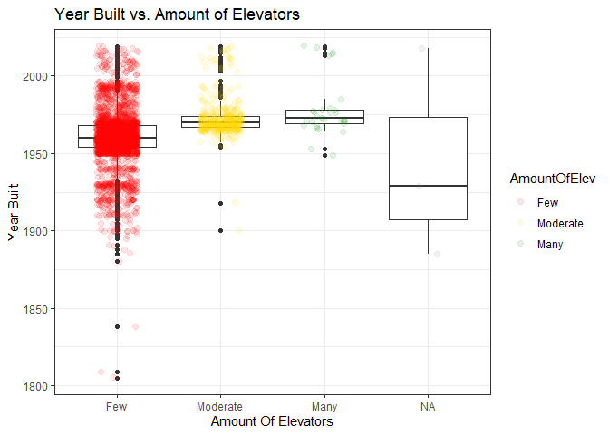
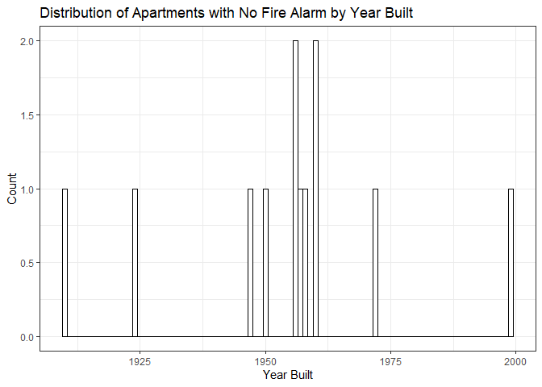
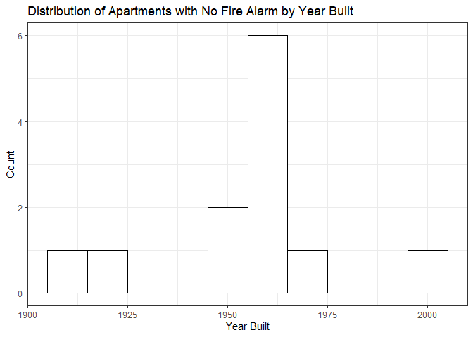
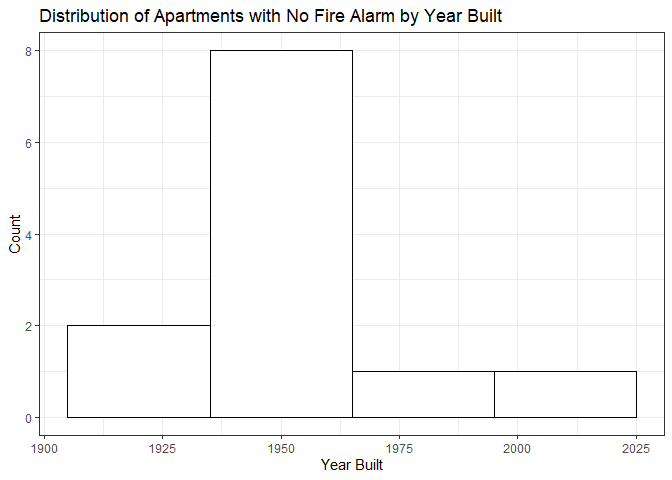
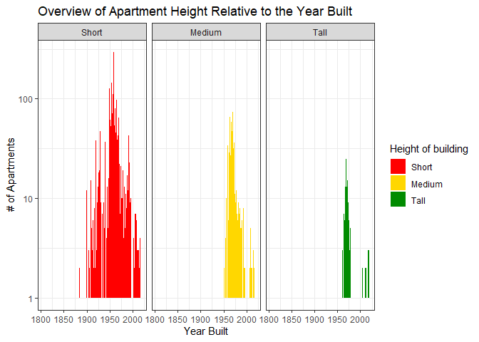
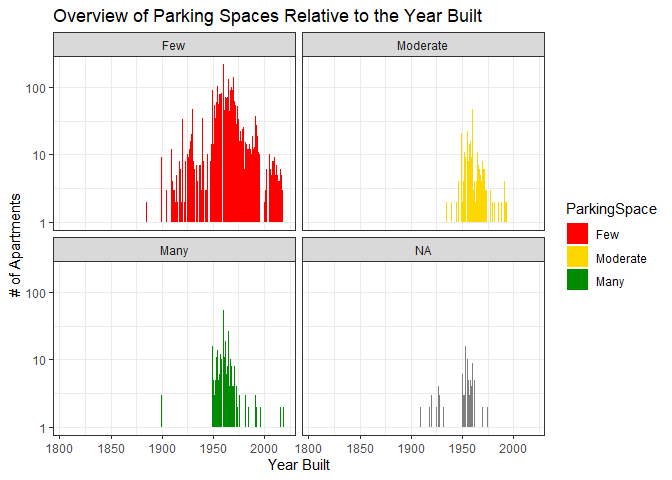

Mini Data Analysis Milestone 2
================

*To complete this milestone, you can either edit [this `.rmd`
file](https://raw.githubusercontent.com/UBC-STAT/stat545.stat.ubc.ca/master/content/mini-project/mini-project-2.Rmd)
directly. Fill in the sections that are commented out with
`<!--- start your work here--->`. When you are done, make sure to knit
to an `.md` file by changing the output in the YAML header to
`github_document`, before submitting a tagged release on canvas.*

# Welcome to the rest of your mini data analysis project!

In Milestone 1, you explored your data. and came up with research
questions. This time, we will finish up our mini data analysis and
obtain results for your data by:

- Making summary tables and graphs
- Manipulating special data types in R: factors and/or dates and times.
- Fitting a model object to your data, and extract a result.
- Reading and writing data as separate files.

We will also explore more in depth the concept of *tidy data.*

**NOTE**: The main purpose of the mini data analysis is to integrate
what you learn in class in an analysis. Although each milestone provides
a framework for you to conduct your analysis, it’s possible that you
might find the instructions too rigid for your data set. If this is the
case, you may deviate from the instructions – just make sure you’re
demonstrating a wide range of tools and techniques taught in this class.

# Instructions

**To complete this milestone**, edit [this very `.Rmd`
file](https://raw.githubusercontent.com/UBC-STAT/stat545.stat.ubc.ca/master/content/mini-project/mini-project-2.Rmd)
directly. Fill in the sections that are tagged with
`<!--- start your work here--->`.

**To submit this milestone**, make sure to knit this `.Rmd` file to an
`.md` file by changing the YAML output settings from
`output: html_document` to `output: github_document`. Commit and push
all of your work to your mini-analysis GitHub repository, and tag a
release on GitHub. Then, submit a link to your tagged release on canvas.

**Points**: This milestone is worth 50 points: 45 for your analysis, and
5 for overall reproducibility, cleanliness, and coherence of the Github
submission.

**Research Questions**: In Milestone 1, you chose two research questions
to focus on. Wherever realistic, your work in this milestone should
relate to these research questions whenever we ask for justification
behind your work. In the case that some tasks in this milestone don’t
align well with one of your research questions, feel free to discuss
your results in the context of a different research question.

# Learning Objectives

By the end of this milestone, you should:

- Understand what *tidy* data is, and how to create it using `tidyr`.
- Generate a reproducible and clear report using R Markdown.
- Manipulating special data types in R: factors and/or dates and times.
- Fitting a model object to your data, and extract a result.
- Reading and writing data as separate files.

# Setup

Begin by loading your data and the tidyverse package below:

``` r
library(datateachr) # <- might contain the data you picked!
library(tidyverse)
```

# Task 1: Process and summarize your data

From milestone 1, you should have an idea of the basic structure of your
dataset (e.g. number of rows and columns, class types, etc.). Here, we
will start investigating your data more in-depth using various data
manipulation functions.

### 1.1 (1 point)

First, write out the 4 research questions you defined in milestone 1
were. This will guide your work through milestone 2:

<!-------------------------- Start your work below ---------------------------->

1.  Do newer apartments have more elevators?
2.  Does the year of the apartment built affect the presence of fire
    alarms?
3.  Are newer apartments taller?
4.  Do newer apartments come with more parking spaces?
    <!----------------------------------------------------------------------------->

Here, we will investigate your data using various data manipulation and
graphing functions.

### 1.2 (8 points)

Now, for each of your four research questions, choose one task from
options 1-4 (summarizing), and one other task from 4-8 (graphing). You
should have 2 tasks done for each research question (8 total). Make sure
it makes sense to do them! (e.g. don’t use a numerical variables for a
task that needs a categorical variable.). Comment on why each task helps
(or doesn’t!) answer the corresponding research question.

Ensure that the output of each operation is printed!

Also make sure that you’re using dplyr and ggplot2 rather than base R.
Outside of this project, you may find that you prefer using base R
functions for certain tasks, and that’s just fine! But part of this
project is for you to practice the tools we learned in class, which is
dplyr and ggplot2.

**Summarizing:**

1.  Compute the *range*, *mean*, and *two other summary statistics* of
    **one numerical variable** across the groups of **one categorical
    variable** from your data.
2.  Compute the number of observations for at least one of your
    categorical variables. Do not use the function `table()`!
3.  Create a categorical variable with 3 or more groups from an existing
    numerical variable. You can use this new variable in the other
    tasks! *An example: age in years into “child, teen, adult, senior”.*
4.  Compute the proportion and counts in each category of one
    categorical variable across the groups of another categorical
    variable from your data. Do not use the function `table()`!

**Graphing:**

6.  Create a graph of your choosing, make one of the axes logarithmic,
    and format the axes labels so that they are “pretty” or easier to
    read.
7.  Make a graph where it makes sense to customize the alpha
    transparency.

Using variables and/or tables you made in one of the “Summarizing”
tasks:

8.  Create a graph that has at least two geom layers.
9.  Create 3 histograms, with each histogram having different sized
    bins. Pick the “best” one and explain why it is the best.

Make sure it’s clear what research question you are doing each operation
for!

<!------------------------- Start your work below ----------------------------->

For the first research question “Do newer apartments have more
elevators?” we will look at completing Task 3 to summarize our numerical
variable of the number of elevators into 3 groups: few, moderate, and
many. Few will be less than 3, moderate will be 3 to 4, and many will be
more than 4 elevators. By doing so, we are able to then use this data
and graph it so we can visually see if apartments with more elevators
tend to be newer.

``` r
###This code creates the new categorical variable using the mutate function.
apt_buildings <- apt_buildings %>%
  mutate(
    `AmountOfElev` = case_when(
      no_of_elevators < 3 ~ "Few",
      no_of_elevators >= 3 & no_of_elevators <= 4 ~ "Moderate",
      no_of_elevators > 4 ~ "Many",
      TRUE ~ "unknown"
    )
  )
###This code displays what our newly created variable looks like
apt_buildings %>%
select('AmountOfElev')
```

    ## # A tibble: 3,455 × 1
    ##    AmountOfElev
    ##    <chr>       
    ##  1 Moderate    
    ##  2 Moderate    
    ##  3 Few         
    ##  4 Few         
    ##  5 Few         
    ##  6 Few         
    ##  7 Few         
    ##  8 Few         
    ##  9 Moderate    
    ## 10 Few         
    ## # ℹ 3,445 more rows

Using the data above, we will create a side-by-side boxplot to compare
the spread of the years that the apartments were built in for each
group. We also want to be able to see individual points as well so we
will use both geom_boxplot and geom_point (Task 8).

``` r
###We are going to reorder the levels of our variable "ParkingSpace" so it reads better when we graph it in the next part
apt_buildings <- apt_buildings %>%
  mutate(AmountOfElev = factor(AmountOfElev, levels = c("Few", "Moderate", "Many")))
  

###This creates the boxplot and the points on it
apt_buildings %>%
  ggplot(aes(x = AmountOfElev, y = year_built)) +
  geom_boxplot() +
  labs(title = "Year Built vs. Amount of Elevators",
       x = "Amount Of Elevators",
       y = "Year Built") +
  geom_point(position = position_jitter(width = 0.2), size = 2, aes(color = AmountOfElev), alpha = 0.1) +
  scale_color_manual(values = c("Few" = "red", "Moderate" = "gold", "Many" = "green4")) +
  theme_bw()
```

    ## Warning: Removed 13 rows containing non-finite values (`stat_boxplot()`).

    ## Warning: Removed 13 rows containing missing values (`geom_point()`).

<!-- -->

From the graph above, we can see that the amount of elevators and the
year built does not seem to have a significant association. Of course,
we do have a lot less data points for the “many” group, but even within
that group, we can still see that the majority were built around 1980s’.

Now we will look at the second research question “Does the year of the
apartment built affect the presence of fire alarms?”

We will complete (Task 2) and compute the number of observations for
this variable. First, we will group the data by the “fire_alarm”
variable.

``` r
###This code creates a separate data frame that will allow us to pull the counts of each group within the variable
fire_alarm_counts <- apt_buildings %>%
  group_by(fire_alarm) %>%
  summarize(count = n())

print(fire_alarm_counts)
```

    ## # A tibble: 3 × 2
    ##   fire_alarm count
    ##   <chr>      <int>
    ## 1 NO            12
    ## 2 YES         3356
    ## 3 <NA>          87

``` r
###These codes pull the counts for each group and computes the number of observations for this variable
yes_count <- fire_alarm_counts %>%
  filter(fire_alarm == "YES") %>%
  pull(count)

no_count <- fire_alarm_counts %>%
  filter(fire_alarm == "NO") %>%
  pull(count)

print(yes_count)
```

    ## [1] 3356

``` r
print(no_count)
```

    ## [1] 12

So in general, it seems that most apartments do have a fire alarm,
regardless of the year built. However, we know that 12 apartments do not
have a fire alarm. But what does the distribution look like regarding
the year that these apartments were built in? Let’s create a graph to
see if we can find any interesting results! In fact, we will create 3
histograms with different bin sizes to see which one fits our purpose
best! (Task 9)

Histogram with bin size = 1

``` r
###This code first filters the "fire_alarm" variable and only looks at the data with "NO". Then it creates a histogram
NoFireAlarm <- apt_buildings %>%
  filter(fire_alarm == "NO")

ggplot(NoFireAlarm, aes(x = year_built)) +
  geom_histogram(binwidth = 1, fill = "white", color = "black") +
  labs(title = "Distribution of Apartments with No Fire Alarm by Year Built",
       x = "Year Built",
       y = "Count") +
  theme_bw()
```

<!-- --> Histogram with
bin size = 10

``` r
###This code is identical to the one above, but with a bin size of 10
NoFireAlarm <- apt_buildings %>%
  filter(fire_alarm == "NO")

ggplot(NoFireAlarm, aes(x = year_built)) +
  geom_histogram(binwidth = 10, fill = "white", color = "black") +
  labs(title = "Distribution of Apartments with No Fire Alarm by Year Built",
       x = "Year Built",
       y = "Count") +
  theme_bw()
```

<!-- -->

Histogram with bin size = 30

``` r
###This code is identical to the one above, but with a bin size of 30
NoFireAlarm <- apt_buildings %>%
  filter(fire_alarm == "NO")

ggplot(NoFireAlarm, aes(x = year_built)) +
  geom_histogram(binwidth = 30, fill = "white", color = "black") +
  labs(title = "Distribution of Apartments with No Fire Alarm by Year Built",
       x = "Year Built",
       y = "Count") +
  theme_bw()
```

<!-- -->

From the graphs above, I personally think the bin size of 1 is a bit too
small. Also, we’re not too heavily focused on the exact year that these
buildings were built in, but rather the overall distribution to check if
the apartments with no fire alarms tend to be built earlier on. As such,
I would say the second graph with a bin size of 10 looks the nicest and
also provides us with the information that we need. From previous
graphs, we know that a lot of the buildings were built around the
1950-1960’s so it’s not a surprise that the distribution of apartments
with no fire alarms look like this. It also shows that there is a new
apartment (built around 2000) without fire alarms as well, so overall,
the presence (or the lack of) of fire alarms seem similar regardless of
the year built.

Now we are going to look at our third research question “Are newer
apartments taller?”

For this part, the numerical variable “no_of_storeys” will be used to
create a categorical variable (Task 3). The new categorical variable
will have groups “short, medium, tall” to describe approximately how
tall our apartments are. This allows us to quickly determine if the
building is tall or short by categorize the height of each building into
3 groups. In this analysis, we will say that an apartment that has less
than 10 storeys will be considered “short,” 10-20 storeys will be
considered “medium,” and more than 20 storeys will be considered “tall.”

``` r
###This code creates the new categorical variable using the mutate function.
apt_buildings <- apt_buildings %>%
  mutate(
    `Height of building` = case_when(
      no_of_storeys < 10 ~ "Short",
      no_of_storeys >= 10 & no_of_storeys <= 20 ~ "Medium",
      no_of_storeys > 20 ~ "Tall",
      TRUE ~ "unknown"
    )
  )
###This code displays what our newly created variable looks like
apt_buildings %>%
select('Height of building')
```

    ## # A tibble: 3,455 × 1
    ##    `Height of building`
    ##    <chr>               
    ##  1 Medium              
    ##  2 Medium              
    ##  3 Short               
    ##  4 Short               
    ##  5 Short               
    ##  6 Short               
    ##  7 Short               
    ##  8 Short               
    ##  9 Tall                
    ## 10 Short               
    ## # ℹ 3,445 more rows

Since we have our new variable, let’s create a bar graph (Task 6) to
display this data. We will make the y-axis logarithmic and edit the axis
labels to make the graph look nicer.

``` r
###We are going to reorder the levels of our variable "Height of buildling" so it reads better when we facet it in the next part
apt_buildings <- apt_buildings %>%
  mutate(`Height of building` = factor(`Height of building`, levels = c("Short", "Medium", "Tall")))

###This code creates a faceted bar graph that displays how many buildings built in different years are short, medium, and tall
ggplot(apt_buildings, aes(x = `year_built`, fill = `Height of building`)) +
  geom_bar(position = position_dodge(width = 1)) +
  labs(x = "Year Built", y = "# of Apartments") +
  scale_y_log10() +
  ggtitle("Overview of Apartment Height Relative to the Year Built") +
  scale_fill_manual(values = c("Short" = "red", "Medium" = "gold", "Tall" = "green4")) +
  theme_bw() +
  facet_wrap(~`Height of building`)
```

    ## Warning: Removed 13 rows containing non-finite values (`stat_count()`).

<!-- --> From this
graph, we can easily see that generally, taller buildings were built
later, especially since we do not see any tall buildings before the
1950’s.

Lastly, We will explore our last research question “Do newer apartments
come with more parking spaces?”

To investigate this, similar to what we did for the first and third
research question, we will create 3 groups for our parking spaces: Few,
Moderate, and Many (Task 3). Less than 10 will be “Few”, 10 to 20 will
be “Moderate” and more than 20 will be “Many.” This will allow us to
easily categorize each observation.

``` r
###This code creates the new categorical variable using the mutate function.
apt_buildings <- apt_buildings %>%
  mutate(
    `ParkingSpace` = case_when(
      no_of_accessible_parking_spaces < 10 ~ "Few",
      no_of_accessible_parking_spaces >= 10 & no_of_accessible_parking_spaces <= 20 ~ "Moderate",
      no_of_accessible_parking_spaces > 20 ~ "Many",
      TRUE ~ "unknown"
    )
  )
###This code displays what our newly created variable looks like
apt_buildings %>%
select('ParkingSpace')
```

    ## # A tibble: 3,455 × 1
    ##    ParkingSpace
    ##    <chr>       
    ##  1 Few         
    ##  2 Moderate    
    ##  3 Moderate    
    ##  4 Many        
    ##  5 Moderate    
    ##  6 Few         
    ##  7 Few         
    ##  8 Few         
    ##  9 Few         
    ## 10 Few         
    ## # ℹ 3,445 more rows

Since we have our new variable, let’s create a bar graph (Task 6) to
display this data. We will make the y-axis logarithmic and edit the axis
labels to make the graph look nicer.

``` r
###We are going to reorder the levels of our variable "ParkingSpace" so it reads better when we facet it in the next part
apt_buildings <- apt_buildings %>%
  mutate(ParkingSpace = factor(ParkingSpace, levels = c("Few", "Moderate", "Many"))) 

###This code creates a faceted bar graph that displays how many buildings built in different years have few, moderate, and many parking spaces
ggplot(apt_buildings, aes(x = `year_built`, fill = `ParkingSpace`)) +
  geom_bar(position = position_dodge(width = 1)) +
  labs(x = "Year Built", y = "# of Apartments") +
  scale_y_log10() +
  ggtitle("Overview of Parking Spaces Relative to the Year Built") +
  scale_fill_manual(values = c("Few" = "red", "Moderate" = "gold", "Many" = "green4")) +
  theme_bw() +
  facet_wrap(~`ParkingSpace`)
```

    ## Warning: Removed 13 rows containing non-finite values (`stat_count()`).

<!-- --> From the graph
above, it doesn’t seem like newer apartments have more parking spaces.
If anything, it seems like most of the apartments with many parking
spaces were built between 1950 to 1975.
<!----------------------------------------------------------------------------->

### 1.3 (2 points)

Based on the operations that you’ve completed, how much closer are you
to answering your research questions? Think about what aspects of your
research questions remain unclear. Can your research questions be
refined, now that you’ve investigated your data a bit more? Which
research questions are yielding interesting results?

<!------------------------- Write your answer here ---------------------------->

I think these operations got me a decent understanding of answering my
research questions. We can see that except for the third question which
was “Are newer apartments taller?”, the year of the apartment being
built necessarily did not mean that it had an impact on the other 3
variables in the other research questions, which were number of
elevators, presence of fire alarms, and number of parking spaces. This
suggests that regarding these variables, an apartment being newer did
not mean that it was better.

However, we did see that taller apartments generally were built more
recently, which helps to answer my overarching question of “Are newer
apartments better?” It does seem that the taller buildings are
relatively newer, which makes them a lot cooler than short, old
apartments.

<!----------------------------------------------------------------------------->

# Task 2: Tidy your data

In this task, we will do several exercises to reshape our data. The goal
here is to understand how to do this reshaping with the `tidyr` package.

A reminder of the definition of *tidy* data:

- Each row is an **observation**
- Each column is a **variable**
- Each cell is a **value**

### 2.1 (2 points)

Based on the definition above, can you identify if your data is tidy or
untidy? Go through all your columns, or if you have \>8 variables, just
pick 8, and explain whether the data is untidy or tidy.

<!--------------------------- Start your work below --------------------------->

Let’s look at our data.

``` r
apt_buildings %>%
  select(separate_gas_meters, separate_hydro_meters, separate_water_meters, fire_alarm, heating_type, intercom, laundry_room, no_of_elevators)
```

    ## # A tibble: 3,455 × 8
    ##    separate_gas_meters separate_hydro_meters separate_water_meters fire_alarm
    ##    <chr>               <chr>                 <chr>                 <chr>     
    ##  1 NO                  YES                   NO                    YES       
    ##  2 NO                  YES                   NO                    YES       
    ##  3 NO                  YES                   NO                    YES       
    ##  4 NO                  YES                   NO                    YES       
    ##  5 NO                  YES                   NO                    YES       
    ##  6 NO                  YES                   NO                    YES       
    ##  7 NO                  YES                   NO                    YES       
    ##  8 NO                  YES                   NO                    YES       
    ##  9 NO                  YES                   NO                    YES       
    ## 10 NO                  NO                    NO                    YES       
    ## # ℹ 3,445 more rows
    ## # ℹ 4 more variables: heating_type <chr>, intercom <chr>, laundry_room <chr>,
    ## #   no_of_elevators <dbl>

Since we have a lot of data, we are going to choose 8 variables:
separate_water_meters, separate_hydro_meters, separate_gas_meters,
fire_alarm, heating_type, intercom, laundry_room, no_of_elevators. We
can see that each row is an observation (a specific apartment), each of
these variables listed above is a column, and the cells are the values
for the variables/columns. For example, the fire_alarm variable that we
used in our second research question is tidy because the variable is a
column, each row is an observation and the cell is the value YES or NO.
So if we were to apply that about the other variables we have here, we
have a tidy data!

<!----------------------------------------------------------------------------->

### 2.2 (4 points)

Now, if your data is tidy, untidy it! Then, tidy it back to it’s
original state.

If your data is untidy, then tidy it! Then, untidy it back to it’s
original state.

Be sure to explain your reasoning for this task. Show us the “before”
and “after”.

<!--------------------------- Start your work below --------------------------->

We will first load tidyr

``` r
library(tidyr)
```

We will take the three variables, separate_gas_meters,
separate_hydro_meters, and separate_water_meters, and use pivot_longer.
We will make new variables called “TypeOfMeter” and “PresenceOfMeter”.
The resulting dataset would be untidy, since the TypeOfMeter variable
combines information about different types of meters. This would be
untidy if we wanted to compare the presence of gas meters vs hydro
meters, as each row is not an observation and the variables are not in
their own columns.

``` r
###I will pivot longer into a new version of the data so we don't have to worry about accidentally messing up other stuff in the process and have the untidy version remaining for further use later if needed.
apt_buildings_untidy_data <- apt_buildings %>%
  pivot_longer(
    cols = c(`separate_gas_meters`, `separate_hydro_meters`, `separate_water_meters`),
    names_to = "TypeOfMeter",
    values_to = "PresenceOfMeter"
  )
```

``` r
###This prints our untidy data
apt_buildings_untidy_data %>%
select('TypeOfMeter', 'PresenceOfMeter')
```

    ## # A tibble: 10,365 × 2
    ##    TypeOfMeter           PresenceOfMeter
    ##    <chr>                 <chr>          
    ##  1 separate_gas_meters   NO             
    ##  2 separate_hydro_meters YES            
    ##  3 separate_water_meters NO             
    ##  4 separate_gas_meters   NO             
    ##  5 separate_hydro_meters YES            
    ##  6 separate_water_meters NO             
    ##  7 separate_gas_meters   NO             
    ##  8 separate_hydro_meters YES            
    ##  9 separate_water_meters NO             
    ## 10 separate_gas_meters   NO             
    ## # ℹ 10,355 more rows

Now let’s use pivot_wider and get our data back to the original format
by making the values in the TypeOfMeter variable into columns with the
values from PresenceOfMeter variable.

``` r
###This uses pivot_wider to revert the changes back to normal
back_to_original <- apt_buildings_untidy_data %>%
  pivot_wider(
    names_from = TypeOfMeter,
    values_from = PresenceOfMeter
  )

###This displays our reverted data
back_to_original %>%
  select('separate_gas_meters', `separate_hydro_meters`, `separate_water_meters`)
```

    ## # A tibble: 3,455 × 3
    ##    separate_gas_meters separate_hydro_meters separate_water_meters
    ##    <chr>               <chr>                 <chr>                
    ##  1 NO                  YES                   NO                   
    ##  2 NO                  YES                   NO                   
    ##  3 NO                  YES                   NO                   
    ##  4 NO                  YES                   NO                   
    ##  5 NO                  YES                   NO                   
    ##  6 NO                  YES                   NO                   
    ##  7 NO                  YES                   NO                   
    ##  8 NO                  YES                   NO                   
    ##  9 NO                  YES                   NO                   
    ## 10 NO                  NO                    NO                   
    ## # ℹ 3,445 more rows

We can see that we have our original variables/columns back! We have
successfully reverted the changes.

<!----------------------------------------------------------------------------->

### 2.3 (4 points)

Now, you should be more familiar with your data, and also have made
progress in answering your research questions. Based on your interest,
and your analyses, pick 2 of the 4 research questions to continue your
analysis in the remaining tasks:

<!-------------------------- Start your work below ---------------------------->

1.  Are newer apartments taller?
2.  Does the year of the apartment built affect the presence of fire
    alarms?

<!----------------------------------------------------------------------------->

Explain your decision for choosing the above two research questions.

<!--------------------------- Start your work below --------------------------->

I chose these research questions because I believe that they provide a
variety of observations/data to answer my overarching question of “Are
newer apartments better?” As I mentioned previously, I really do believe
the best part about an apartment is the fact that they are tall. If so,
I think it is crucial to focus on the research question “Are newer
apartments taller?” to answer my overarching question. I also chose the
question “Does the year of the apartment built affect the presence of
fire alarms?” as this question considers the safety aspects of what
makes a “good” apartment. If I were to only focus on the height of the
building, but the buildings were very unsafe, that wouldn’t make it a
very good apartment overall. So I wanted to choose the other research
question that could answer the safety aspect as well.
<!----------------------------------------------------------------------------->

Now, try to choose a version of your data that you think will be
appropriate to answer these 2 questions. Use between 4 and 8 functions
that we’ve covered so far (i.e. by filtering, cleaning, tidy’ing,
dropping irrelevant columns, etc.).

(If it makes more sense, then you can make/pick two versions of your
data, one for each research question.)

<!--------------------------- Start your work below --------------------------->

``` r
###We will first remove unnecessary variables by choosing only the ones we need
apt_buildings_new <- apt_buildings %>%
  select(year_built, fire_alarm, no_of_storeys, `Height of building`) %>%

###Now we rename the variables using CamelCase     
  rename(YearBuilt = year_built, FireAlarm = fire_alarm, NumberOfFloors = no_of_storeys, HeightOfBuilding = 'Height of building') %>%

###We will also arrange the dataset by the year built to make it look nice and ascending based on year, since that is our main focus in this research
  arrange(YearBuilt) %>%
  
###Then finally, we will drop the rows with missing data
  drop_na()
  
head(apt_buildings_new)
```

    ## # A tibble: 6 × 4
    ##   YearBuilt FireAlarm NumberOfFloors HeightOfBuilding
    ##       <dbl> <chr>              <dbl> <fct>           
    ## 1      1805 YES                    5 Short           
    ## 2      1809 YES                    4 Short           
    ## 3      1838 YES                    3 Short           
    ## 4      1880 YES                    3 Short           
    ## 5      1885 YES                    3 Short           
    ## 6      1885 YES                    3 Short

<!----------------------------------------------------------------------------->

# Task 3: Modelling

## 3.0 (no points)

Pick a research question from 1.2, and pick a variable of interest
(we’ll call it “Y”) that’s relevant to the research question. Indicate
these.

<!-------------------------- Start your work below ---------------------------->

**Research Question**: Are newer apartments taller?

**Variable of interest**: NumberOfFloors

<!----------------------------------------------------------------------------->

## 3.1 (3 points)

Fit a model or run a hypothesis test that provides insight on this
variable with respect to the research question. Store the model object
as a variable, and print its output to screen. We’ll omit having to
justify your choice, because we don’t expect you to know about model
specifics in STAT 545.

- **Note**: It’s OK if you don’t know how these models/tests work. Here
  are some examples of things you can do here, but the sky’s the limit.

  - You could fit a model that makes predictions on Y using another
    variable, by using the `lm()` function.
  - You could test whether the mean of Y equals 0 using `t.test()`, or
    maybe the mean across two groups are different using `t.test()`, or
    maybe the mean across multiple groups are different using `anova()`
    (you may have to pivot your data for the latter two).
  - You could use `lm()` to test for significance of regression
    coefficients.

<!-------------------------- Start your work below ---------------------------->

To test whether newer apartments tend to be taller, we can perform a
linear regression analysis. We can use ‘lm()’ to fit a linear regression
model to our variable of interest. Our y will be the number of floors
and our x will be the year built.

``` r
###This fits a linear regression model with respect to my research question
model <- lm(NumberOfFloors ~ YearBuilt, data = apt_buildings_new)

###This prints the result
print(model)
```

    ## 
    ## Call:
    ## lm(formula = NumberOfFloors ~ YearBuilt, data = apt_buildings_new)
    ## 
    ## Coefficients:
    ## (Intercept)    YearBuilt  
    ##   -235.9154       0.1242

<!----------------------------------------------------------------------------->

## 3.2 (3 points)

Produce something relevant from your fitted model: either predictions on
Y, or a single value like a regression coefficient or a p-value.

- Be sure to indicate in writing what you chose to produce.
- Your code should either output a tibble (in which case you should
  indicate the column that contains the thing you’re looking for), or
  the thing you’re looking for itself.
- Obtain your results using the `broom` package if possible. If your
  model is not compatible with the broom function you’re needing, then
  you can obtain your results by some other means, but first indicate
  which broom function is not compatible.

<!-------------------------- Start your work below ---------------------------->

We will load broom first.

``` r
library(broom)
```

Then we will use tidy() to get a statistical summary of our model and
look at the column ‘p-value’ to get our p-value of the intercept and the
predictor (YearBuilt).

``` r
tidy(model)
```

    ## # A tibble: 2 × 5
    ##   term        estimate std.error statistic   p.value
    ##   <chr>          <dbl>     <dbl>     <dbl>     <dbl>
    ## 1 (Intercept) -236.     10.4         -22.8 7.90e-107
    ## 2 YearBuilt      0.124   0.00528      23.5 2.10e-113

We can see that the p-value is 7.89804e-107 and 2.10415e-113 for the
intercept and the predictor (YearBuilt) respectively.

<!----------------------------------------------------------------------------->

# Task 4: Reading and writing data

Get set up for this exercise by making a folder called `output` in the
top level of your project folder / repository. You’ll be saving things
there.

## 4.1 (3 points)

Take a summary table that you made from Task 1, and write it as a csv
file in your `output` folder. Use the `here::here()` function.

- **Robustness criteria**: You should be able to move your Mini Project
  repository / project folder to some other location on your computer,
  or move this very Rmd file to another location within your project
  repository / folder, and your code should still work.
- **Reproducibility criteria**: You should be able to delete the csv
  file, and remake it simply by knitting this Rmd file.

<!-------------------------- Start your work below ---------------------------->

We will first load the package ‘readr’ and ‘here’ to do this.

``` r
library(readr)
library(here)
```

    ## here() starts at C:/Users/andyk/OneDrive/University/MSc/1st Year/STAT 545A/mda-akim2000

``` r
###This defines the output file path
file_path <- here("output", "fire_alarm_counts.csv")

###This writes the summary table to a CSV file
write_csv(fire_alarm_counts, file_path)
```

<!----------------------------------------------------------------------------->

## 4.2 (3 points)

Write your model object from Task 3 to an R binary file (an RDS), and
load it again. Be sure to save the binary file in your `output` folder.
Use the functions `saveRDS()` and `readRDS()`.

- The same robustness and reproducibility criteria as in 4.1 apply here.

<!-------------------------- Start your work below ---------------------------->

``` r
# Define the output file path for the RDS file using here::here()
model_path <- here("output", "model.rds")

# Save the model object to an RDS file
saveRDS(model, model_path)

# Load the model object from the RDS file
loaded_model <- readRDS(model_path)
```

<!----------------------------------------------------------------------------->

# Overall Reproducibility/Cleanliness/Coherence Checklist

Here are the criteria we’re looking for.

## Coherence (0.5 points)

The document should read sensibly from top to bottom, with no major
continuity errors.

The README file should still satisfy the criteria from the last
milestone, i.e. it has been updated to match the changes to the
repository made in this milestone.

## File and folder structure (1 points)

You should have at least three folders in the top level of your
repository: one for each milestone, and one output folder. If there are
any other folders, these are explained in the main README.

Each milestone document is contained in its respective folder, and
nowhere else.

Every level-1 folder (that is, the ones stored in the top level, like
“Milestone1” and “output”) has a `README` file, explaining in a sentence
or two what is in the folder, in plain language (it’s enough to say
something like “This folder contains the source for Milestone 1”).

## Output (1 point)

All output is recent and relevant:

- All Rmd files have been `knit`ted to their output md files.
- All knitted md files are viewable without errors on Github. Examples
  of errors: Missing plots, “Sorry about that, but we can’t show files
  that are this big right now” messages, error messages from broken R
  code
- All of these output files are up-to-date – that is, they haven’t
  fallen behind after the source (Rmd) files have been updated.
- There should be no relic output files. For example, if you were
  knitting an Rmd to html, but then changed the output to be only a
  markdown file, then the html file is a relic and should be deleted.

Our recommendation: delete all output files, and re-knit each
milestone’s Rmd file, so that everything is up to date and relevant.

## Tagged release (0.5 point)

You’ve tagged a release for Milestone 2.

### Attribution

Thanks to Victor Yuan for mostly putting this together.
